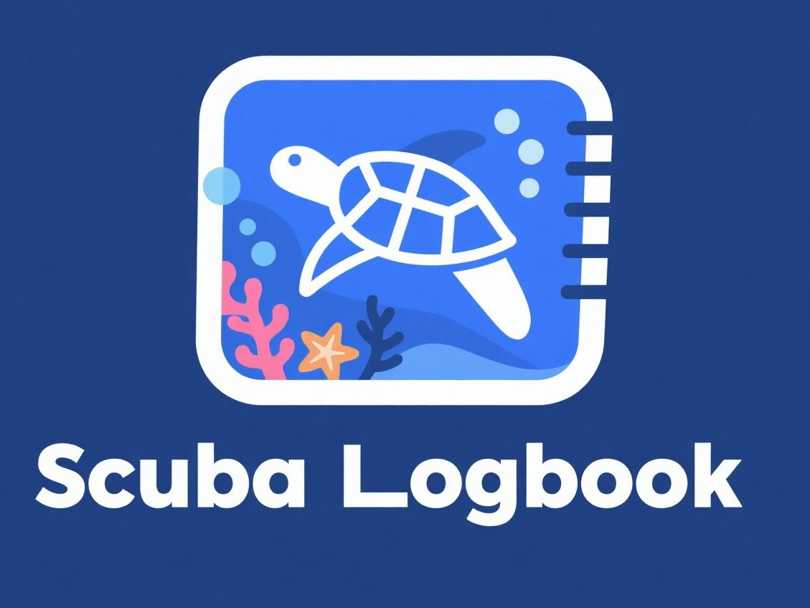

<p align="center">
  
</p>

## Description

A Scuba Loogbook API based on [Nest](https://github.com/nestjs/nest) framework.

## Project setup

Ensure [Node.js](https://nodejs.org/en/download) is installed on your local machine, then run the following command:
```bash
$ npm install
```

## Compile and run the project on Docker

Ensure [Docker](https://docs.docker.com/engine/install/) and [Docker Compose](https://docs.docker.com/compose/install/) are installed on your local machine, then run the following command:
```bash
docker compose up -d
```

## Compile and run the project on local

1. Ensure [PostgreSQL](https://www.postgresql.org/download/) is installed on your local machine.
2. Create a new database.
3. Update the `.env` file with your local DB credentials, then use the following commands:

```bash
# development
$ npm run start

# watch mode
$ npm run start:dev

# production mode
$ npm run start:prod
```

## Run tests

```bash
# unit tests
$ npm run test

# e2e tests
$ npm run test:e2e

# test coverage
$ npm run test:cov
```
